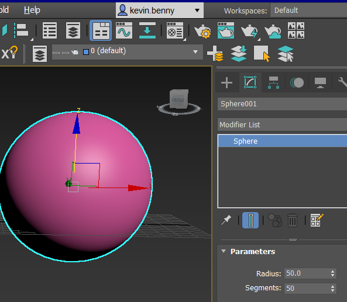

# **Stretch Modifier**

**Definition:**

Using a Stretch Modifier, objects are stretched by pulling from both opposite ends. If the two ends are pressed, the objects are inflated. By giving the limit values, the operation can be done in the determined region. 

The Stretch command is entered in the following ways: 

Modify panel →Modifier List → Stretch 

Modifiers menu →  Parametric Deformers → Stretch

**Procedure:**

To stretch an object follow these steps:

1. Create an object using the basic shapes. Select the desired object that you want to stretch.
1. Apply Stretch modifier from the modifier list that is available in the modify panel
1. You can see different options such as the stretch amount and its intensity
1. You can also choose its stretch axis, that is to choose whether you want to stretch from the x-axis, y-axis, or z-axis. Make sure you have ticked the limit effects tickbox on. Change the upper limit and lower limit to control the stretch boundaries on both sides of the center plane chosen. You can change the stretch center by selecting the center sub-object under the modifier stack list.
1. There will be an option to also give an upper limit or lower of the object you stretched.
1. Adjustments to the Amplify setting can be done to change the strength of scaling to be done on the object along the selected axes.

Extending an Object using Stretch:

1. Let's create a sphere with Radius=50andSegments=50 and the object is created and selected. Apply the Sphere Modifier.
1. We can see how each adjustment alter the sphere we have selected 

1. The following adjustments are made in the Parameters section:

1. After applying the above 

**Advantages:**

1. Provides different additional modifiers like amplify, the select axis of stretch, limit, change center plain, etc that make it easier to modify to your needs.
1. It is very easy to use and provides a very smooth and perfect shaped modified image.
1. It’s Memory-Efficient and doesn’t give a heavy load when rendering.
1. Using this modifier, we can obtain the desired structure with speed and precision.

**Comparative Study:**

Using the stretch modifier we either Squash an object or Stretch an object by adjusting its parameter

|Squash|Stretch|
| - | - |
|This squeezes or compresses the object that is selected|This stretches the object based on the selected axis|
|Value of stretch parameter should be less than 1|Value of stretch parameter should be more than 1|
|Positive amplification will make the middle of the object fatter|Positive amplification will squeeze the selected object in the middle as the object stretches|
|Negative amplification will squeeze the object in the middle as it stretches|Negative amplification will make the middle of the object fatter|

**Modifier functionalities:**

**Center**
**
`	`This lets you change the center reference to transform and animate the selected object, hence altering the plain changes the structure of the selected stretched object. This basically changes the center point of reference on how the stretch modifier affects the object.

**Gizmo**
**
`	`This lets you change the gizmo of the selected object, hence affecting the structure and how the stretch modifier act on the object. Changing the gizmo changes the center of alteration equidistant from the object. When altering the shape and position of the gizmo, it happens based on the center point of the plain. Unlike center, gizmo lets you rotate as well as scale the alternation plane. 

**Stretch**
**
`	`Sets the base factor of stretching the object on the different axes. The intensity of stretching depends on the sign as well as the value entered.

**Stretch Axis group**

This lets you choose on which axis you want to stretch the selected object. There will be the option to choose between the x, y, z-axis of the object. Depending on the selected axis the stretch modifier will apply and stretch the object on that axis.

**Limits group**

Limit parameter lets you either apply the effect on the entire object or limit it to a particular portion of the object. This can be done using the controls in the limits group. The limit group option lets you restrict the stretch effect along the positive and negative Stretch Axis of the selected object.

**Limit Effect**
**
`	`This Limits the region on the object where you want to stretch. This helps you target the stretch effect to a particular position.  When it is turned off, no limit effect is applied to the object, i.e. the value that is entered will have no effect on the object. If it is turned on based on the upper limit and lower limit, the stretch effect is applied.

**Upper Limit**
**
`	`This will give the upper bound of the modifier hence giving the upper limit for the stretch modifier on the positive axis. The stretch effect will affect the selected object only till that point or limit. Its value can be between 0 and any positive number.

**Lower Limit**
**
`	`This will give the lower bound of the modifier hence giving the lower limit for stretch modifier on the negative axis. The stretch effect will affect the selected object only till that point or limit. Its value can be between 0 and any negative number.

**Amplify**
**
`    `Changes the scaling factor applied to the selected object on the specific axis chosen. Amplify alters the structure based on the value entered, increasing the values increasing the stretching effect on the gizmo plain.

·       Value 0 has no effect on the object. The default scale factor is considered 0 and this gives the base for calculating the Stretch intensity.

·       Positive values increase the effect on the selected object.

·       Negative values reduce the effect on the selected object.
**

**Project:**

1. Open Autodesk 3ds max in your system

1. Let's create a GeoSphere with Radius=50andSegments=50 and the object is created and selected. Drag and drop the object on the grid.

1. Apply the Sphere Modifier from the modifier list.

1. Under the stretch parameter, altering the stretch value will cause the object to stretch or squeeze the selected object. When the value is below 0 the gets squeezed. 

1. When the value is above 0 the object gets stretched. We can see how the sphere changes its shape as it stretches.

1. Setting the stretch value as 2.0

1. The amplify parameter alters the stretching effect on the gizmo plane. Setting its value as 1.0.

1. Tick the limit effect to set the upper limit and lower limit to the object. Set the upper limit to 20 so that we get a stretch closer to the upper region.

1. Alter the stretch limit and amplify to get the ideal structure.

1. Now let’s change the gismo plane. Once you select gismo, you can move the plane that is virtually shown on the object. Altering this changes the stretch modifier effect on the object.

1. Cloning the object multiple times.

1. Providing material, texture, and color to the objects.

1. Providing the right surroundings by adding multiple objects to suit its place.

1. Hurray!! Strike!!!!

