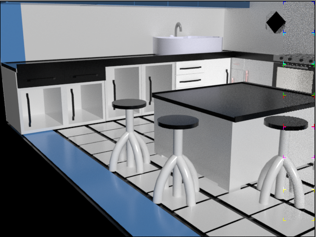

Working with color palette and layers.

Basic Steps:

1\. Dragged and dropped necessary objects from standard properties.

2\. Edited the object as required, arraigned and aligned the objects. The cupboards was made using a rectangle and then extending it into a 3d object. With the help of script further smoothing of the structure can be done.

Grouped and layered the items based on the set. For example the cupboards was grouped and then the doors of the cupboards was layer vise grouped and its handle was further layered.

3\. With the help of lathe modifier, other required structure was created. 

4\. Kitchen items like stove, kitchen hood ventilator, sink, microwave(under the stove) etc. was added to provide the best environment of a kitchen.

5\. Chose the correct color to obtain the realistic image and changed the material to metallic for cupboards and ventilator, ceramic for the tiles, glass for the door of cupboard etc.

Screenshot :

Rendered view: 

ViewPort: 

Side view:

