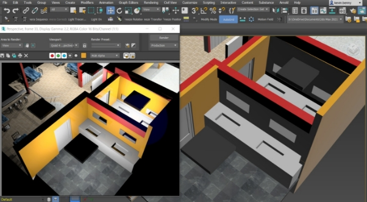

Name: Kevin Benny

USN no: 1941028

Date: 5 Sep’2021

Question: Creation of images with special effects.

- Basic Steps: Dragged and dropped necessary objects.
- Standard primitives used: Box, Tube, Cylinder, Cone, Plane, Geosphere, Circle, Torus
- Edited the objects accordingly.
- Modifiers used: Shell, Rotate, Scale, Snap tool, Boolean, Bend, Edit Poly, Twist.
- Materials: Scanline
- Lights: Standard->Omni

Resulting in a Stunning Food Court

Screenshot:

RENDERED:

TOP

LEFT

